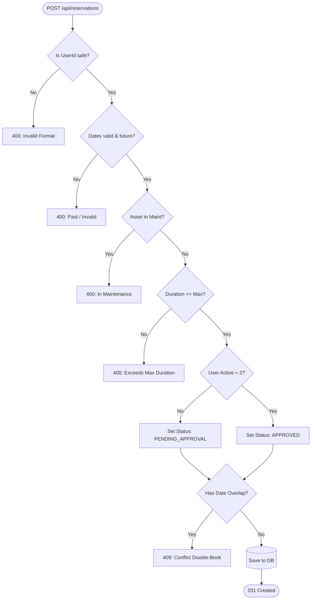

# Stage 4: Design Document

## 1. Data Models

### `Asset`
Represents an inventoriable piece of corporate equipment.
- `id` (String): Unique identifier (e.g., 'A1').
- `name` (String): Display name of the equipment.
- `category` (String): Grouping category (e.g., 'Laptop', 'Monitor').
- `status` (Enum): `AVAILABLE`, `MAINTENANCE`.
- `maxDuration` (Integer): Maximum allowed checkout duration in days.

### `Reservation`
Represents a user's booking for an asset.
- `id` (String): Auto-incremented reservation ID (e.g., 'R1').
- `assetId` (String): Foreign key to the Asset.
- `userId` (String): String representing the user who booked it.
- `startDate` (ISO Date String): Start date of checkout.
- `endDate` (ISO Date String): End date of checkout.
- `status` (Enum): `APPROVED`, `PENDING_APPROVAL`, `CANCELLED`, `RETURNED`.
- `createdAt` (ISO Date String): Timestamp of creation.

## 2. API Specifications (Key Flows)

### Request Validation Lifecycle
The `POST /api/reservations` endpoint acts as a strict security and business-logic gatekeeper.

### `GET /api/assets`
- **Purpose**: Retrieve catalog of available assets.
- **Response**: `200 OK` Array of `Asset` objects.

### `POST /api/reservations`
- **Purpose**: Create a new reservation.
- **Payload**: `{ "assetId": "A1", "userId": "test", "startDate": "YYYY-MM-DD", "endDate": "YYYY-MM-DD" }`
- **Success Response**: `201 Created` with created `Reservation` object.

### `POST /api/reservations/:id/cancel`
- **Purpose**: Cancel an active reservation.
- **Success Response**: `200 OK` `{ "message": "Reservation cancelled successfully." }`

## 3. Error Handling Matrix
The application uses strict input validation. Errors return a standard JSON format: `{ "error": "Description" }`

| Scenario | HTTP Status Code | Message |
| :--- | :--- | :--- |
| Missing required fields | 400 Bad Request | "Missing required fields." |
| Script injection in `userId` | 400 Bad Request | "Invalid userId format." |
| End date before Start date | 400 Bad Request | "End date must be strictly after start date." |
| Booking in the past | 400 Bad Request | "Cannot book in the past." |
| Asset in maintenance | 400 Bad Request | "Asset is currently in maintenance." |
| Booking duration > `maxDuration` | 400 Bad Request | "Exceeds maximum duration of X days for this asset." |
| Date Overlap (Double Book) | 409 Conflict | "Asset is already reserved for the requested dates." |
